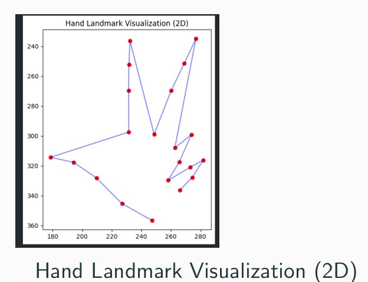

# Smartboard Control using Hand Gestures

## 📌 Project Overview
This project implements a **Smartboard Control System** that allows users to control digital screens, presentations, or smartboards using **hand gestures**. By leveraging **Computer Vision (CV)** and **Deep Learning** techniques, the system recognizes predefined gestures and maps them to specific smartboard actions such as changing slides, writing, erasing, or highlighting.

The aim is to create a **hands-free, touchless interface** that makes classroom teaching, corporate presentations, and interactive sessions more seamless.

---

## 🎯 Features
- 🖐️ **Gesture Recognition**: Detects and classifies hand gestures in real time.
- 🎥 **Real-time Processing**: Uses webcam input for live gesture control.
- 📊 **Smartboard Control**: Supports actions like:
  - Next / Previous Slide
  - Highlighting
  - page up and down
  - Erasing
- ⚡ **Fast & Efficient**: Built with optimized deep learning and computer vision pipelines.

---

## 🛠️ Tech Stack
- **Programming Language:** Python 3.x
- **Libraries/Frameworks:**
  - OpenCV (image/video processing)
  - MediaPipe (hand tracking)
  - TensorFlow / PyTorch (gesture classification)
  - NumPy & Pandas (data processing)
  - PyAutoGUI (for simulating keyboard/mouse actions)
- **Hardware:** Standard webcam or external camera

---

## 📂 Project Structure
```
smartboard-gesture-control/
│
├── data/                   # Dataset for training gestures
├──| models/                 # Saved trained models
|  |--notebooks/              # Jupyter notebooks for experiments
|
├── requirements.txt        # Dependencies
├── README.md               # Project documentation

```

---

## 🚀 Installation
1. Clone the repository:
   ```bash
   git clone https://github.com/subhakanta156/Smartboard-control-using-Handgestures.git
   cd Smartboard-control-using-Handgestures
   ```

2. Create a virtual environment (optional but recommended):
   ```bash
   python -m venv venv
   source venv/bin/activate   # On Linux/Mac
   venv\Scripts\activate      # On Windows
   ```

3. Install dependencies:
   ```bash
   pip install -r requirements.txt
   ```

---

## ▶️ Usage
1. Run the application:
 
2. Perform hand gestures in front of the camera.

3. The smartboard actions (slide change, draw, erase) will be triggered automatically.

---

## 🧪 Dataset
- A Hand-land mark data is collect from Hugging face. hand is contained 21 landmarks.
- Possible classes: **Swipe Left, Swipe Right, Point, Palm, Fist, Erase, Draw**.
- Alternatively, **MediaPipe Hand Landmarks** can be used to train a lightweight gesture classifier.
- image of **21 landmarks of hand**
   

- Total gesture is detected in from my data
   
   


---

## 🔮 Future Improvements
- Add **voice command integration** alongside gestures.
- Extend support for **multi-hand gestures**.
- Improve accuracy with a larger dataset.
- Deploy as a **desktop application** or **web app** for teachers.

---

## 🤝 Contribution
Contributions are welcome! Please follow these steps:
1. Fork the repository
2. Create a new branch (`feature/new-feature`)
3. Commit your changes
4. Push to your branch
5. Create a Pull Request

---

## 📜 License
This project is licensed under the MIT License.

---

## 👨‍💻 Author
**Your Name**  
MSc AI & ML | Aspiring Data Engineer & ML Engineer  
IIIT Lucknow

📧 Contact: subhakantarath01@gmail.com 
🔗 LinkedIn: [Your Profile](linkedin.com/in/subhakanta-rath-0b45b0326)  
